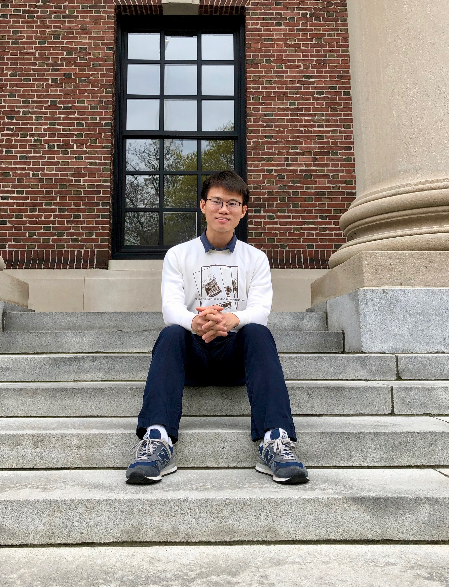

## Dongming Huang

Welcome!

[//]: # I am a 5th year Ph.D. student in statistics at Harvard University, co-advised by Samuel Kou and Lucas Janson. My research interests include high-dimensional statistics and Bayesian inference. 

I am an Assistant Professor in the Department of Statistics and Applied Probability at the National University of Singapore. Prior to NUS, I received my Ph.D. in Statistics from Harvard University, where I was co-advised by Professors Samuel Kou and Lucas Janson. In 2015, I received a B.S. in Mathematics from Peking University in China. 

I am especially interested in developing new methods for efficient and stable statistical analyses of the dependence structures in high-dimensional data, and establishing their theoretical guarantees. Specifically, I have been worked on dimension reduction using inverse regression, variable selection using Model-X knockoffs, and Bayesian prior specification.

{:height="50%" width="50%"}

**Contact**

[//]: Science Center 908\\
[//]: One Oxford Street\\
[//]: Cambridge, MA 02138\\
[stahd@nus.edu.sg](mailto:stahd@nus.edu.sg)
